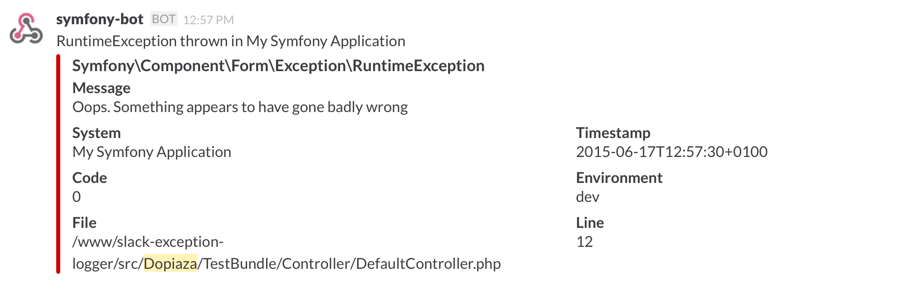

#Slack Exception Logger Bundle for Symfony2

This bundle allows exceptions thrown in a symfony2 app to be logged automatically to a [Slack](https://slack.com) channel.



To use, you first need to set up an incoming webhook in Slack - you can do this at https://your_slack_instance.slack.com/services/new/incoming-webhook (replace _your_slack_instance_ with whatever your particular Slack instance is called). Once you've done that, you'll be given a web hook URL - make a note of that, you'll need to add that to your `config.yml` file.

Install this bundle into your symfony app:

```
$ composer require dopiaza/slack-exception-logger-bundle
```

Next, add the bundle to `registerBundles` in `AppKernel.php`:

```
new Dopiaza\Slack\ExceptionLoggerBundle\DopiazaSlackExceptionLoggerBundle(),
            
```

And then set up your `config.yml`:

```
dopiaza_slack_exception_logger:
    webhook: https://hooks.slack.com/services/T0000000/B000000000/000000000000000000
    botname: symfony-bot
    name: My Symfony Application
    environments:
        test:
            enabled: true
            channel: symfony-exceptions
        prod:
            channel: symfony-exceptions
            exclude_exception:
                - Symfony\Component\HttpKernel\Exception\NotFoundHttpException

```

`webhook` is the URL of the incoming web hook for your Slack instance.

`botname` is the name of the user that message will be posted as in your Slack channel. This defaults to `symfony-bot`.

`name` is the name of your symfony application. This is useful if you have multiple apps all posting to the same channel.

`environments` holds all environment specific configuration settings. Usual values to include in here would be `dev`, `test` and `prod`. If the environment being used isn't listed in this section, no exceptions will be posted. You probably don't really want to list `dev` in here, as that one is likely to generate quite a bit of noise, but hey, it's your choice.

`enabled` is an optional boolean to allow logging to be enabled or disabled on a per-channel basis. If not specified, it defaults to true.

`channel` is the name of the channel to which exceptions are posted. 

`exclude_exception` is an optional array of `Exception` class names which should be ignored. A typical use for this would be avoid a plethora of 'Not Found' exceptions being displayed for a production server that's publicly visible and thus subject to people randomly probing it. 

